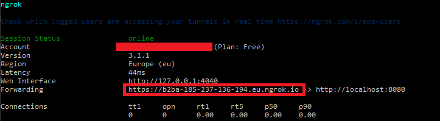

# The CRM Service - Full example

This document aims to describe the steps for a complete configuration and execution of the API from a local environment and **for testing purposes**.

## Expose the API port on your machine

Even if you intend to test the API locally, you need to expose your API port (8080 in this example) to Internet in order to enable the authorization flow.

This can be done by port-forwarding in case your router has a public IP.

If you are looking for a more direct and less tedious option, you can use a ngrok tunnel to your machine:

1) Download ngrok from [here](https://ngrok.com/download).
2) Create an account on their website and join [here](https://dashboard.ngrok.com/get-started/your-authtoken).
3) Copy the command you will see in the `Command Line` section and apply it on a console.
4) Open the tunnel with the following command:
``` bash
ngrok http 8080
```
5) Copy the URL shown in the forwarding row:



## Create a Github OAuth application

This application uses OAuth2 with Github as authentication provider, so it is necessary to register your application as Github OAuth application.

To do this, you must access [this link](https://github.com/settings/developers).

From here you must create an OAuth application. Fill in the fields as you want but make sure that in the `Authorization callback URL` field you add the following:

```
<The URL you copied in the previous step>/v1/login/oauth2/github/authorize
```

When you create the application you will access its configuration panel. From here you must save the following fields:
- **Client ID**
- **Client secret** (you have to generate it)

## Create a local database

To do this you just need to create a container with the Docker image of PostgreSQL using the following command:

``` bash
docker run --env=POSTGRES_PASSWORD=docker -p 5432:5432 -d postgres
```

## Compile the project

Just execute:

``` bash
git clone git@github.com:crolopez/the-crm-service.git
cd the-crm-service
mvn clean install
mvn io.fabric8:fabric8-maven-plugin:build
```

## Launch the application

It is necessary to set the environment variables properly while creating the container. To do this:

``` bash
docker run -p 8080:8080 \
    --env DATASOURCE="jdbc:postgresql://host.docker.internal:5432/postgres" \
    --env DB_USERNAME="postgres" --env DB_PASSWORD="docker"  \
    --env OAUTH2_CLIENT_ID="<OAUTH2_CLIENT_ID>"  \
    --env OAUTH2_CLIENT_SECRET="<OAUTH2_CLIENT_ID>" \
    --env FIRST_USER_IS_ADMIN=true \
    --env CACHE_EXPIRATION_TIME=2 \
    the-crm-service
```

The variables `<OAUTH2_CLIENT_ID>` and `<OAUTH2_CLIENT_ID>` are extracted from [Create a Github OAuth application](#Create a Github OAuth application) section.

## Login into the application

If your application for interacting with APIs supports multiple redirects to web sites, launch a GET request to the following endpoint:
http://localhost:8080/v1/login/oauth2/github

If it is not possible, just open it from the browser.

This will redirect us to the Github login form. We enter the credentials and log in.

Finally, we take the authentication token that we received in the response headers. If you opened the page from the browser, reload the previous endpoint with the developer options open to see the token.

With this token we are now ready to launch API requests. You can use [this Insomnia collection](../../insomnia-collection.json) as a guide.